# Project 11. Denial of Service (DoS) Attacks

# Part 1 – Introduction to Denial of Service (DoS)

## Objective

I want to understand the basics of Denial of Service (DoS) and Distributed Denial of Service (DDoS) attacks. I need to know how they affect system and network availability and what techniques attackers use.

# What is Denial of Service (DoS)?

A Denial of Service (DoS) attack is when someone tries to make a computer, server, application or network resource to its users. This happens by using up its resources like CPU, memory, bandwidth or network connections.

The main goal of a DoS attack is to stop a service from working not to steal data like in types of attacks.

# What is Distributed Denial of Service (DDoS)?

A Distributed Denial of Service (DDoS) attack is a version of a DoS attack. Here many infected devices work together to send a lot of traffic to one target.

These infected devices are called bots or zombies. Someone controls them from a distance.

# DoS vs DDoS

Here's a comparison:

* Denial of Service (DoS) uses one attacking system.

* Distributed Denial of Service (DDoS) uses infected systems.

* DoS is easier to detect.

* DDoS is harder to detect.

* DoS sends traffic.

* DDoS sends traffic.

* DoS is easier to stop.

* DDoS is harder to stop.

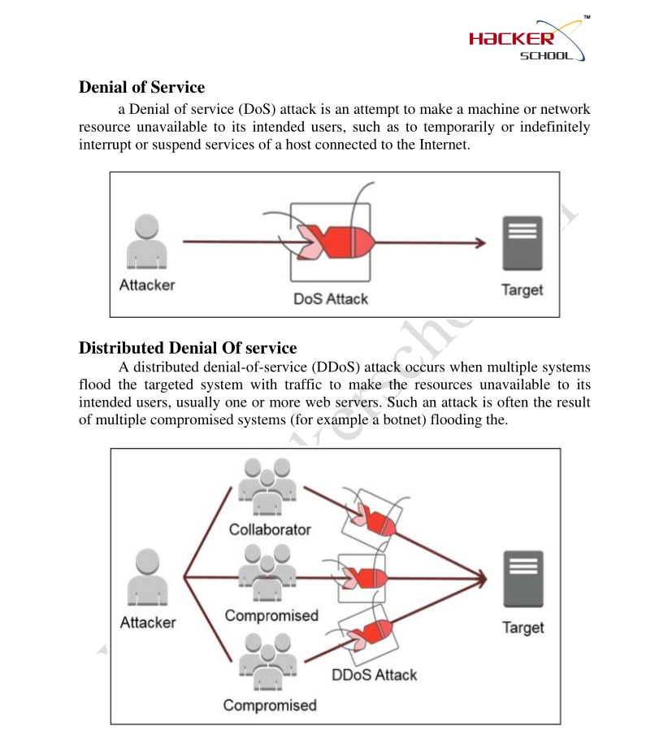

**DoS vs DDoS**

```text

dos-vs-ddos-comparison.png

```

# Botnet

A botnet is a group of devices connected to the Internet that are infected with malware. Someone controls them from a distance.

Botnets are often used for:

- DDoS attacks

- Sending spam emails

- Spreading malware

- Creating Internet traffic

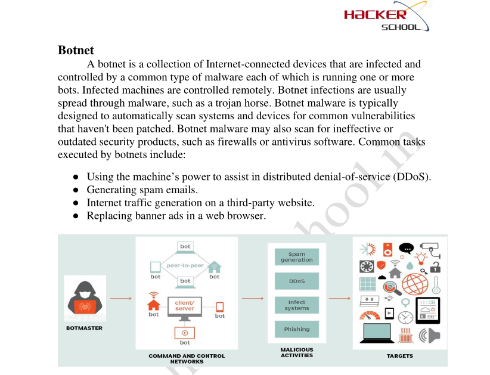

**Botnet**

```text

botnet-overview.png

```

# Common DoS Attack Types

Some common Denial of Service attack techniques are:

- TCP SYN Flood

- UDP Flood

- HTTP Flood

- Ping of Death

- MAC Flooding

Each of these attacks targets different protocols or network resources to overwhelm the target system. This prevents users from accessing services.

# Countermeasures

To reduce the impact of DoS and DDoS attacks organizations can use:

- Firewalls

- Intrusion Detection Systems (IDS)

- Intrusion Prevention Systems (IPS)

- Traffic Filtering

- Rate Limiting

- Load Balancers

- Web Application Firewalls (WAF)

- Content Delivery Networks (CDN)

- Continuous Network Monitoring

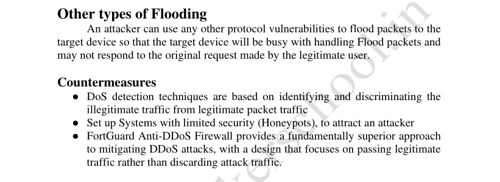

**Countermeasures**

```text

dos-countermeasures.png

```

# Learning Outcome

After learning this I now know:

- The difference between DoS and DDoS attacks.

- How botnets are used for DDoS attacks.

- Common types of DoS attacks.

- measures to reduce DoS attacks.

- Why service availability is important, during cyberattacks.

# conclusion

In this part I learned about Denial of Service (DoS) and Distributed Denial of Service (DDoS) attacks. 
I now understand how botnets contribute to large-scale attacks, techniques used to disrupt services and defensive measures to maintain system availability.


-------------------------------------------------------------------------------------------------------------------------------------------------------------------------------------------

# Project 11. Denial of Service Attacks

# Part 2 – Common Denial of Service Attack Techniques

## Objective

I want to understand the Denial of Service attack techniques that are used the most. I need to know how these Denial of Service attacks target network resources and how they affect system availability.

---

# TCP SYN Flood

A TCP SYN Flood attack is when someone sends a lot of SYN requests to a server without finishing the connection. This is like a handshake. When you shake hands with someone you expect them to shake back.. In this case the person just keeps putting out their hand without waiting for a response.

As a result the server gets tired of waiting and runs out of resources. This means that real users cannot connect to the server. The Denial of Service attack is successful because the server is busy waiting for all these connections to finish.

### Characteristics

- The TCP SYN Flood attack uses the three-way handshake.

- It creates a lot of half open connections.

- It uses up the servers memory and connection resources.

- It makes the service less available to users.

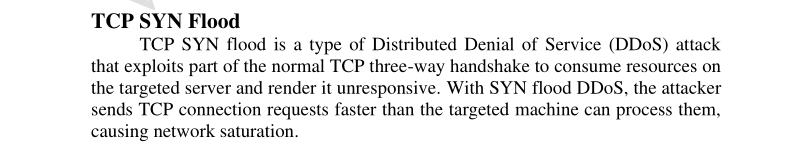

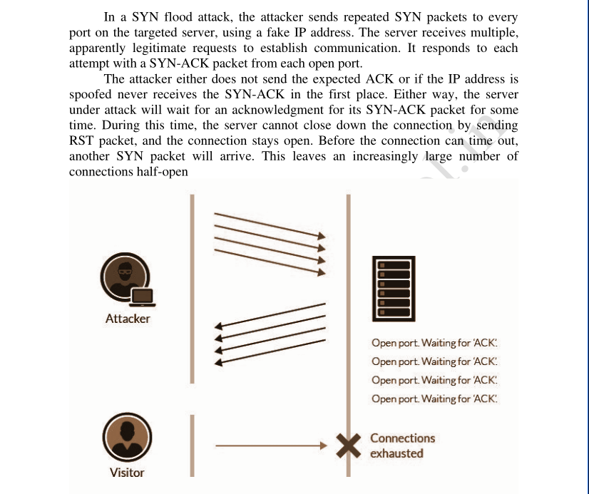
**TCP SYN Flood**

```text

tcp-syn-flood-overview.png

```

I need to get the **TCP SYN Flood** diagram from the CEHv13 module.

---

# UDP Flood

A UDP Flood attack is when someone sends a lot of UDP packets to a server. The server tries to process each packet. It gets overwhelmed. This is like trying to drink from a firehose. The server just cannot keep up.

The UDP Flood attack uses the UDP protocol to send packets to specific ports on the server. The server tries to process each packet. It uses up a lot of bandwidth and processing power.

### Characteristics

- The UDP Flood attack uses the UDP protocol.

- It uses up a lot of bandwidth.

- It makes the server work harder which increases CPU utilization.

- It might also generate ICMP responses.

---

# ICMP Flood

An ICMP Flood attack is when someone sends a lot of ICMP Echo Request packets to a server. This is like an echo. The server keeps responding to each request but it gets overwhelmed.

This type of Denial of Service attack is also known as a Ping Flood. The ICMP Flood attack sends ICMP Echo Request packets to overwhelm the target system or network.

### Characteristics

- The ICMP Flood attack uses ICMP Echo Requests.

- It uses up a lot of bandwidth.

- It makes the network slower, which increases latency.

- It might make some services unavailable.

---

# HTTP Flood

An HTTP Flood attack targets web applications by sending a lot of HTTP requests. These requests look real. It is hard to tell them apart from legitimate traffic.

The HTTP Flood attack is different from floods because it works at the application layer. This means it targets web servers specifically.

### Characteristics

- The HTTP Flood attack targets web servers.

- It is hard to distinguish from traffic.

- It uses up web server resources.

---

# Other Flooding Attacks

There are types of flooding attacks, such as the Ping of Death MAC Flooding and Smurf Attack. Each of these Denial of Service attacks uses a technique but they all have the same goal. To use up system or network resources and deny service to real users.

---

# SOC Analyst Perspective

SOC analysts watch network traffic to find spikes excessive SYN packets, abnormal UDP traffic, ICMP floods and a lot of HTTP requests. If they find something they can investigate and take action before the services become unavailable. This is, like having a security guard who watches the network and protects it from Denial of Service attacks.

---

# Key Concepts Learned

- TCP SYN Flood

- UDP Flood

- ICMP Flood

- HTTP Flood

- Ping of Death

- MAC Flooding

- Smurf Attack

- Network Availability

---

# conclusion

In this part I learned about the most common Denial of Service attack techniques. I learned how these Denial of Service attacks target network protocols to use up system resources. 
I also learned how security teams find these attacks and protect network availability by watching the network and using controls. 
The Denial of Service attacks are a threat but with the right knowledge and tools we can protect our networks and systems.


---------------------------------------------------------------------------------------------------------------------------------------------------------------------------------------------------

# Project 11. Denial of Service Attacks

# Part 3 – Understanding and Demonstrating Flood Attacks

## Objective

I want to understand how people can use network protocols to launch Denial of Service attacks. In this part I will learn about UDP Flood attacks. See how to do an ICMP Flood attack using **hping3** in a safe lab setting.

---

# UDP Flood

A UDP Flood attack is a type of Denial of Service attack where someone sends a lot of UDP packets to a target system. The target system tries to process all these packets. If no program is using the port it sends back an ICMP Destination Unreachable message. Doing this with a lot of packets can use up system resources and network bandwidth.

### Characteristics

- It uses the User Datagram Protocol (UDP).

- It does not need a connection to send data.

- It uses up network bandwidth.

- It makes the CPU work harder.

- It can make the system send back ICMP Destination messages.

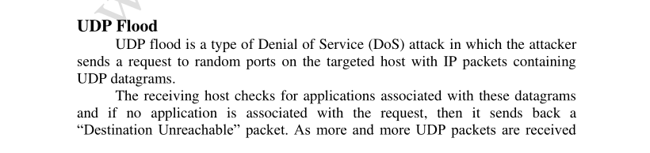

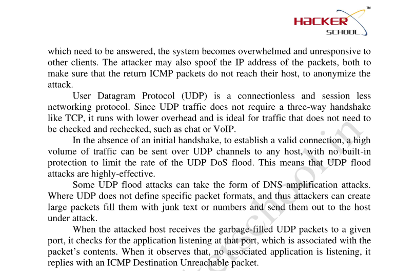

**UDP Flood**

```text

udp-flood-overview.png

```

---

# ICMP Flood

An ICMP Flood attack, also known as a **Ping Flood** happens when someone sends a lot of ICMP Echo Request packets to a target system. This can use up bandwidth. Make the system slow so real users cannot use the network services.

### Characteristics

- It uses ICMP Echo Request packets.

- It uses up network bandwidth.

- It makes the network slower.

- It can make network services Unreachable unavailable.

---

# ICMP Flood Using hping3 (Practical)

## Lab Setup

| Machine | Role |


| Kali Linux | The machine that launches the attack |

| Ubuntu 14.04 | The target machine |

| hping3 | The tool used to launch the attack |

Wireshark | The tool used to monitor network traffic |

---

## Command Used

I used the command on the Kali Linux machine to launch an ICMP Flood attack on the Ubuntu target machine.

```bash

sudo hping3 --icmp --flood <Target_IP>

```

Replace `<Target_IP>` with the IP address of the Ubuntu target machine.

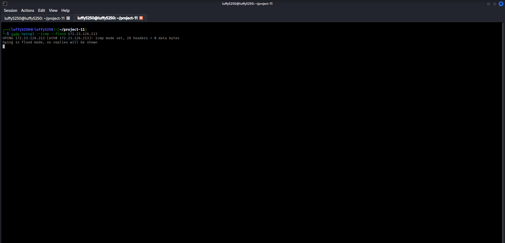

**ICMP Flood Using hping3**

```text

icmp-flood-hping3-terminal.png

```

---

## Traffic Analysis

During the attack I used Wireshark on the Ubuntu target machine to see the incoming ICMP traffic. I saw a lot of ICMP Echo Request packets, which meant the attack was successful.

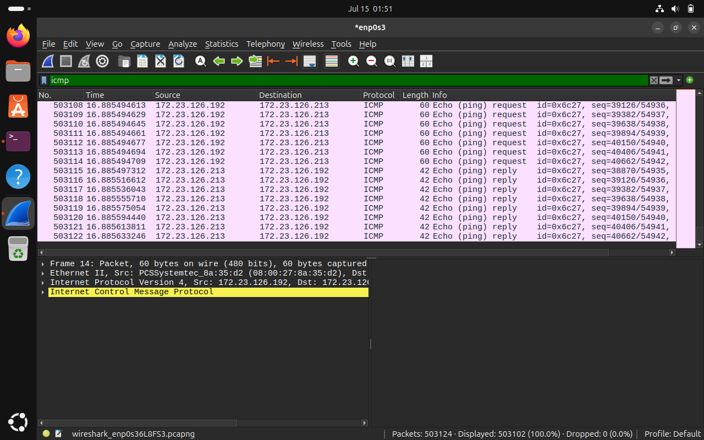

**ICMP Traffic Analysis**

```text

icmp-flood-wireshark.png

```

---

## Observation

During the demonstration:

- I sent a lot of ICMP Echo Request packets.

- Wireshark caught a lot of ICMP packets.

- The target machines network activity increased a lot.

- The practical demonstration showed how excessive ICMP traffic can affect network availability in a controlled lab setting.

---

# Comparison

| TCP SYN Flood | UDP Flood | ICMP Flood |


| It exploits the three-way handshake | It sends a lot of UDP packets | It sends a lot of ICMP Echo Request packets |

| It creates open connections | It uses up bandwidth and processing resources | It uses up bandwidth and network resources |

| It targets services | It targets UDP services | It targets ICMP processing |

---

# SOC Analyst Perspective

SOC analysts always watch for TCP UDP and ICMP traffic using network monitoring tools, intrusion detection systems and SIEM platforms. If they see an increase, in ICMP traffic or a lot of Echo Requests it could be the start of a Denial of Service attack and they should look into it right away.

---

# Key Concepts Learned

- UDP Flood

- ICMP Flood

- hping3

- ICMP Echo Request

- Network Traffic Analysis

- Wireshark

- Denial of Service

- Network Availability

- Resource Exhaustion

---

# conclusion

In this part I learned how UDP Flood attacks use up system resources with a lot of UDP traffic and how to do an ICMP Flood attack using **hping3** in a lab. 
I also learned how Wireshark can help monitor and analyze ICMP traffic during an attack, which helps security professionals find network behavior.


-----------------------------------------------------------------------------------------------------------------------------------------------------------------------------------------------------------------------------


# Project 11. Denial of Service Attacks

# Part 4 – TCP SYN Flood Using Metasploit Framework

## Objective

I want to learn how to do a SYN Flood attack using the Metasploit Framework. This is a test in an environment. The Metasploit Framework can make a lot of SYN flood traffic to a target service. This is for security testing and learning.

---

# TCP SYN Flood Using Metasploit

The Metasploit Framework has a tool that can make TCP SYN flood traffic to a target host. This tool is not like tools that try to exploit weaknesses. It is used to test if network services are working well by sending a lot of TCP SYN packets.

I did this test in a lab environment with special virtual machines.

---

# Lab Setup

| Machine | Role |


| Kali Linux | Attacker |

| Ubuntu 26.04 | Target |

|Metasploit Framework | Attack Tool |

| Wireshark | Traffic Monitoring |

---

# Launching Metasploit

I start the Metasploit Framework.

```bash

sudo msfconsole -q

```

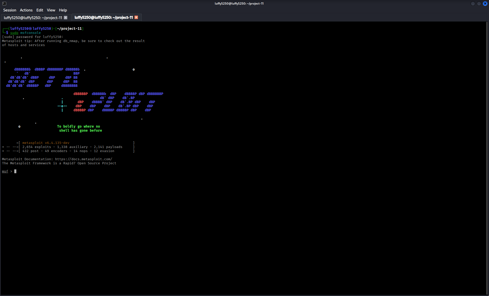

**Metasploit Framework Startup**

```text

metasploit-framework-startup.png

```

---

# Loading the SYN Flood Module

I search for the SYN flood tool. Load it.

```text

search synflood

```

```text

use auxiliary/dos/tcp/synflood

```

I check the options I can change.

```text

show options

```

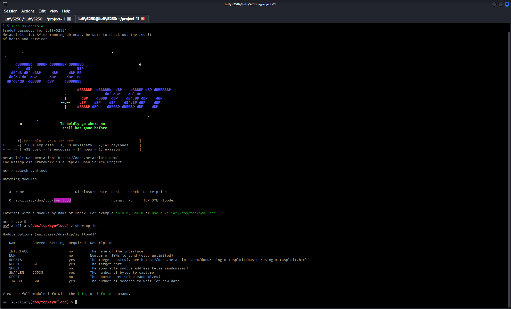

**Metasploit SYN Flood Module**

```text

metasploit-synflood-module.png

```

---

# Configuring the Target

I set up the target.

```text

set RHOSTS <Ubuntu_IP>

```

```text

set RPORT 80

```

I check the setup.

```text

show options

```

---

# Running the Module

I start the SYN flood tool.

```text

run

```

or

```text

exploit

```

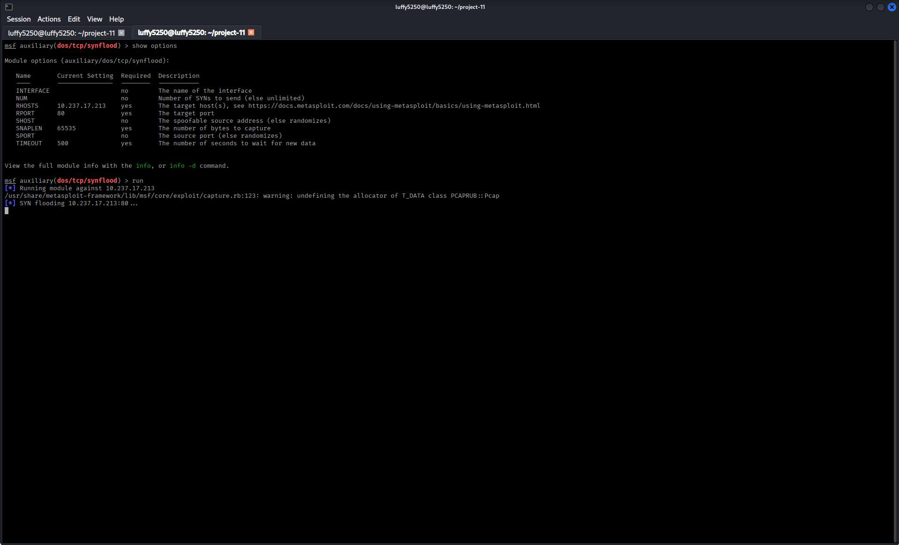

**Metasploit SYN Flood Execution**

```text

metasploit-synflood-execution.png

```
----

## Checking TCP SYN Flood Traffic with Wireshark

After I started the Metasploit TCP SYN Flood tool, from the Kali Linux attacker machine I used Wireshark on the Ubuntu machine to catch and look at the network traffic.

The packet catch shows a lot of TCP SYN packets going to port 80 all the time. This means the traffic I made really got to the target and Wireshark caught it. This test shows how we can use network monitoring tools to find and look at denial-of-service traffic as it is happening.

### What I Found

- The protocol is TCP

- The TCP flag is SYN

- The traffic is going to port 80

- I used Wireshark to catch the packets live

- This confirms that the traffic was made during the Metasploit SYN Flood test

 Checking TCP SYN Flood Traffic with Wireshark

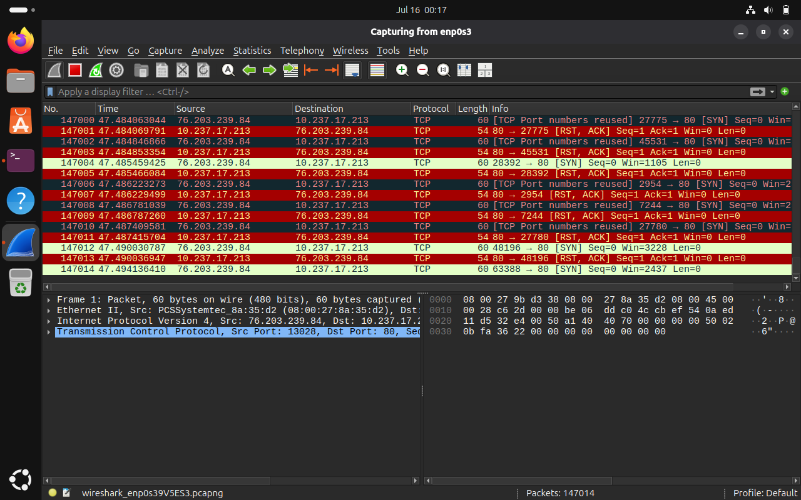

**The Name of the Screenshot File**

```text

ubuntu-wireshark-synflood-packet-capture.png

```

---

# Observation

When I did the test:

- The Metasploit Framework made TCP SYN packets to the target.

- The target service got a lot of SYN requests.

- I can use Wireshark and system monitoring tools to see the increased network activity.

- This test shows how to do denial-of-service testing in a controlled environment.

---

# SOC Analyst Perspective

SOC analysts watch for much SYN traffic because it can be a sign of a SYN Flood attack. They use network monitoring tools IDS/IPS solutions and SIEM platforms to find these patterns and respond quickly to incidents.

---

# Key Concepts Learned

- Metasploit Framework

- Auxiliary Modules

- TCP SYN Flood

- RHOSTS

- RPORT

- Denial of Service

- Network Monitoring

- SYN Packet Analysis

---

# conclusion

In this part I learned how to use the Metasploit Framework to make TCP SYN Flood traffic in a safe environment. 
I also learned how SOC analysts find SYN traffic and monitor denial-of-service activity using network analysis tools. 
The Metasploit Framework is a tool, for TCP SYN Flood attacks.
